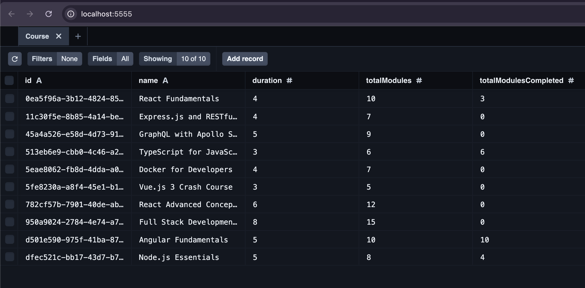

# e-course-server

Provides an api layer for the e-course ui

# Instructions

1. Install dependencies:

   - $ pnpm install

2. Deploy app

   - $ pnpm run dev

3. Open a terminal and inspect the database:

   - $ npx prisma studio
     This will open a tab in your browser (http://localhost:5555/)
     showing the prisma studio client which allows you to inspect
     the data in your database.

4. Check api routes are working as expected using curl

   # Get all courses

   curl http://localhost:3000/courses

   # Create a new course

   curl -X POST -H "Content-Type: application/json" -d '{"name":"New Course", "duration":5, "totalModules":10, "totalModulesCompleted":0}' http://localhost:3000/courses

   # Get a specific course (replace [id] with an actual id)

   curl http://localhost:3000/courses/[id]

   # Update a course (replace [id] with an actual id)

   curl -X PUT -H "Content-Type: application/json" -d '{"name":"Updated Course Name"}' http://localhost:3000/courses/[id]

   # Delete a course (replace [id] with an actual id)

   curl -X DELETE http://localhost:3000/courses/[id]

5. Seed the database with test data:

   - $ pnpm run seed

   If you inspect the db using prisma studio, you'll see
   somthing like:

6. To view the state of your database, execute the following command 
   - $ pnpm db:view

   This should open up a new tab in your browser with the url: localhost:5555

7. Run this script to delete all data in the db:

   - $ pnpm run db:reset

8. Run this script to delete all data in the db and reset with values in the seed.ts file :
   - $ pnpm run db:seed

N.B. In case you have problems deploying:

Run the following command:
 
   $ npx prisma generate